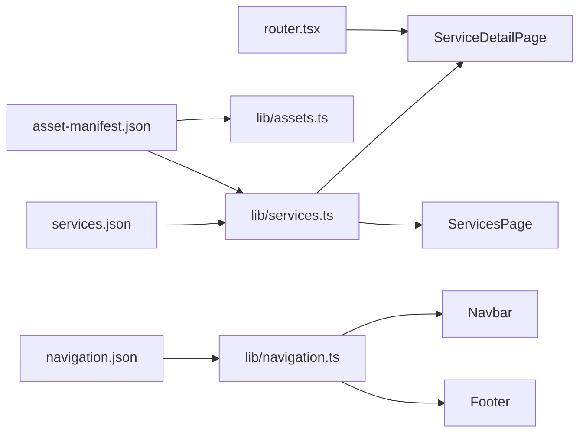

# Service Architecture: The Game Hour v2

> Generated: 2026-05-23  
> Pattern: **one dynamic route, one page component, JSON-driven content**

---

## Design principle

Avoid eight hardcoded service pages. All event types share:

```
/services          → ServicesPage (index)
/services/:slug    → ServiceDetailPage (detail)
```

Content comes from `src/data/services.json`. UI shells use `PlaceholderPage` until designed pages ship.

---

## Data flow



---

## Core modules

| Module | Role |
|--------|------|
| `src/data/services.json` | Hero, intro, selling points, images (legacy paths), CTA, testimonials |
| `src/data/types.ts` | `Service`, `ServicesData`, related types |
| `src/lib/services.ts` | `getAllServices()`, `getServiceBySlug()`, `isValidServiceSlug()`, `getServiceImagePath()` |
| `src/constants/routes.ts` | `ROUTES`, `servicePath(slug)`, `LEGACY_SERVICE_ROUTE_REDIRECTS` |
| `src/pages/ServiceDetailPage.tsx` | Reads `:slug`, loads service, SEO, placeholder shell |
| `src/pages/ServicesPage.tsx` | Lists all services with links to `servicePath(slug)` |
| `src/components/LegacyServiceRedirect.tsx` | Maps old URLs → canonical slug |

---

## Supported service types (8)

| Type | Slug |
|------|------|
| Birthday | `birthday-games` |
| Corporate | `corporate-games` |
| Social | `social-gathering-games` |
| Festival | `game-festival` |
| School | `school-and-collage-event` |
| Wedding | `wedding-or-haldi-games` |
| Traditional | `traditional-games` |
| Bollywood | `bollywood-games` |

Adding a ninth service = append to `services.json` + `navigation.json` footer link + manifest entries. **No new page file required.**

---

## Usage examples

```ts
import { getServiceBySlug, getAllServices } from '@/lib/services'
import { servicePath } from '@/constants/routes'
import { getImageUrl } from '@/lib/assets'

const service = getServiceBySlug('bollywood-games')
const href = servicePath('bollywood-games') // "/services/bollywood-games"
const titleImg = getImageUrl(getServiceImagePath('bollywood-games', 'titleCard'))
```

```tsx
// Future designed page (not built yet)
const { slug } = useParams()
const service = getServiceBySlug(slug)
if (!service) return <Navigate to={ROUTES.services} replace />
// render service.hero, service.sellingPoints, etc.
```

---

## SEO

`ServiceDetailPage` calls `buildSeo({ title: service.name, description: service.shortDescription })` per slug.

---

## Legacy compatibility

Old bookmarked URLs redirect via `LEGACY_SERVICE_ROUTE_REDIRECTS` (see [Route Inventory](../../docs/operations/ROUTE_INVENTORY.md)).

---

## Not in scope (this pass)

- Styled service templates / homepage sections
- Wiring `images.slider` / `images.gallery` arrays to components
- Game library data page content
